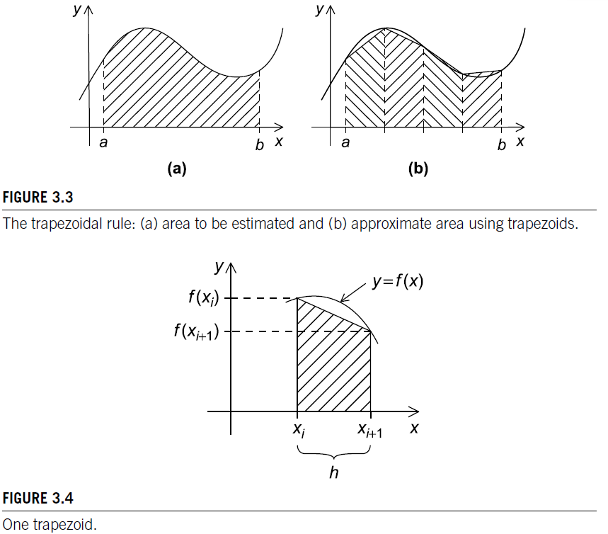
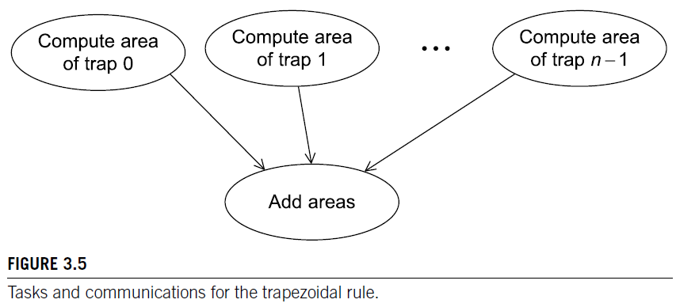

# Chapter 3 - Distributed memory programming with MPI
Textbook: Introduction to Parallel Programming by Pacheco & Malensek, 2022
## Trapezoid example
<!-- {width=100px height=100px} -->


$Area\ of\ one\ trapezoid = {h \over 2}[f(x_i)+f(x_{i+1})]$

$h={{b-a} \over n}$

$x_0=a, x1=a+h, x2=a+2h, ..., x_{n-1}=a+(n-1)h, x=b$

$sum\ of\ trapezoid\ areas=h[f(x_0)/2+f(x_1)+f(x_2)+...+f(x_{n-1})+f(x_n)/2]$

```cpp
/* Input: a, b, n */
h = (b-a)/n
approx = (f(a)+f(b))/2;
for (i = 1; i <= n-1; i++) {
    x_i = a + i*h;
    approx += f(x_i);
}
approx = h*approx;
```

### Paralellizing rule:
1. Partition the problem solution into tasks.
2. Identify communication channels between the tasks.
3. Aggregate tasks into composite tasks.
4. Map composite tasks to cores.



```cpp
1 Get a, b, n;
2 h = (b−a) / n;
3 local_n = n / comm_sz;
4 local_a = a + my_rank ∗ local_n ∗ h;
5 local_b = local_a + local_n ∗ h;
6 local_integral = Trap(local_a, local_b, local_n, h) ;

7 if (my_rank != 0)
8   Send local_integral to process 0 ;
9 else / ∗ my_rank == 0 ∗ /
10  total_integral = local_integral ;
11  for (proc = 1; proc < comm_sz ; proc ++) {
12    Receive local_integral from proc ;
13    total_integral += local_integral ;
14  }
15 
16 if (my_rank == 0)
17  print result;
```